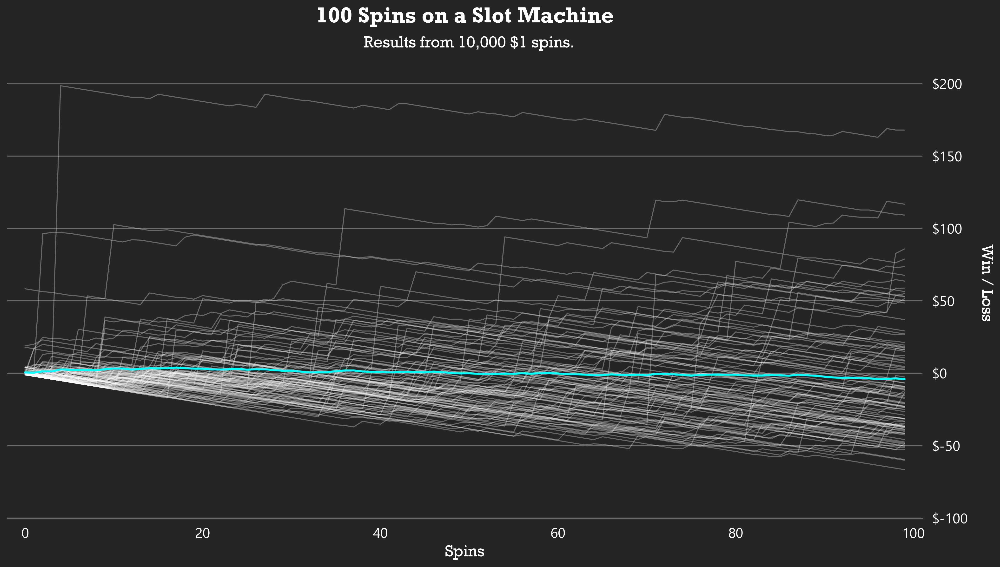

# 10,000 Slot Machine Spins

## Data
The slot machine data is gathered from 10,000 real spins on a [popular video slotmachine](https://games.netent.com/video-slots/starburst/).
I export the website's XHR activity as HAR files and parse the responses from
the slot machine API into a readable format.

The parsed data is stored in `data/slot_machine.txt`.

## Descriptives
The game's developer claims a "Return to Player" (RTP) of 96.09%. From my 10,000
spins sample, I find a RTP of 96.06%. The standard deviation of the spin return
is $4.31.

## Visualization
I use the parsed data to create a plot of 100 attemps of 100 $1 spins (`slot_machine_analysis.ipynb`). The average 100 spins yield a total loss of $3.94. The best attempt out of
100 attemps resulted in a $168 win, the worst in a $66.50 loss.

